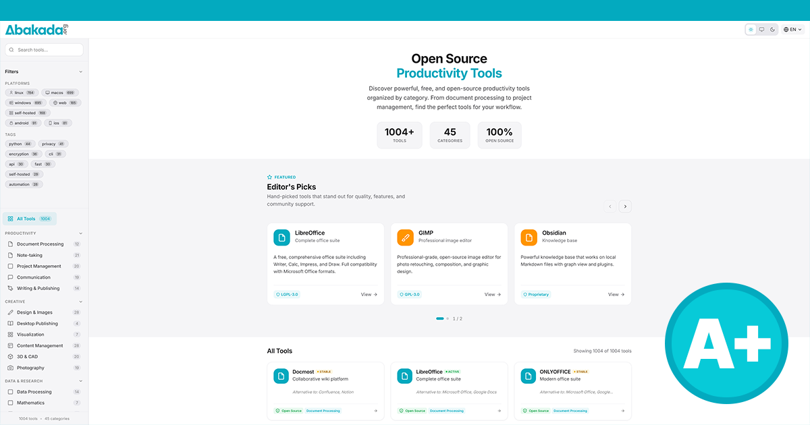

# Abakada - Open Source Productivity Tools

<p align="center">
  
</p>

<p align="center">
  <strong>1000+ Free & Open Source Tools for Filipino Students, Scholars & Educators</strong>
</p>

<p align="center">
  <a href="https://abakada.org">Website</a> •
  <a href="https://abakada.org/about">About</a> •
  <a href="https://abakada.org/faq">FAQ</a> •
  <a href="https://github.com/Abakada-org">GitHub</a>
</p>

<p align="center">
  
  
  
  
</p>

---

## Mission

Abakada is dedicated to serving all people of the Philippines by providing free access to powerful productivity tools. We believe that quality software should never be a barrier to education or success. Our special focus is on supporting underprivileged scholars who deserve the same digital resources as their peers.

---

## Features

### Core Features
- **1000+ Curated Tools** - Comprehensive database of free and open-source productivity tools
- **45 Categories** - Organized into 8 groups: Productivity, Creative, Data & Research, Security, Media, Utilities, Development, Business
- **Advanced Search** - Fuzzy search with Levenshtein distance algorithm, real-time filtering
- **Platform Filters** - Filter by Windows, macOS, Linux, Web, iOS, Android, Self-hosted
- **Tag-based Filtering** - Find tools by functionality tags
- **"Alternative to" Search** - Find open-source alternatives to popular paid software

### User Experience
- **Dark/Light/System Theme** - Automatic theme detection with manual override
- **Internationalization (i18n)** - Full support for English, Tagalog, Ilokano, and Bisaya
- **Responsive Design** - Mobile-first approach, works on all screen sizes
- **Accessibility (WCAG)** - Skip links, ARIA labels, keyboard navigation, screen reader support
- **Reduced Motion Support** - Respects `prefers-reduced-motion` preference

### Performance & SEO
- **Cache-Busting** - Content-hashed filenames for CSS/JS assets
- **Self-Hosted Fonts** - Inter font served locally (no Google Fonts dependency)
- **Minified Assets** - HTML, CSS, JS, and JSON minification
- **Gzip Compression** - Server-side compression via `.htaccess`
- **Browser Caching** - Optimized cache headers for static assets
- **XML Sitemap** - Full sitemap for search engine indexing
- **JSON-LD Structured Data** - Rich search results with schema.org markup
- **Open Graph & Twitter Cards** - Social media sharing optimization

### Security
- **Content Security Policy (CSP)** - Strict CSP headers
- **HSTS** - HTTP Strict Transport Security enabled
- **Security Headers** - X-XSS-Protection, X-Frame-Options, X-Content-Type-Options
- **Referrer Policy** - Strict origin when cross-origin
- **Permissions Policy** - Restricted geolocation, microphone, camera access

---

## Technology Stack

### Frontend


### Architecture
- **CSS Design System** - Custom properties (CSS variables) for theming
- **Modular CSS** - Separated into base, themes, layout, components, animations
- **Vanilla JavaScript** - No framework dependencies, IIFE module pattern
- **JSON Data Store** - Tools and translations stored in JSON files

### Build Tools


| Package | Purpose |
|---------|---------|
| `html-minifier-terser` | HTML minification |
| `clean-css` | CSS minification |
| `terser` | JavaScript minification |
| `fs-extra` | File system operations |

### Server
- **Apache** - `.htaccess` configuration for cPanel deployment
- **Clean URLs** - URL rewriting for extensionless URLs
- **Custom Error Pages** - Branded 404 and 500 pages

---

## Project Structure

```
abakada/
├── assets/
│   ├── css/
│   │   ├── base.css          # Reset, typography, design tokens
│   │   ├── themes.css        # Light/dark theme variables
│   │   ├── layout.css        # Header, sidebar, footer, grid
│   │   ├── components.css    # Cards, buttons, modals, forms
│   │   └── animations.css    # Keyframes, transitions
│   ├── js/
│   │   ├── app.js            # Main application logic
│   │   ├── i18n.js           # Internationalization module
│   │   ├── theme.js          # Theme switching logic
│   │   ├── search.js         # Unified search & filter system
│   │   └── static-page.js    # Static page initialization
│   ├── data/
│   │   ├── tools.json        # Tools database (1000+ entries)
│   │   └── translations/     # Language files (en, tl, ilo, bis)
│   ├── fonts/                # Self-hosted Inter font files
│   └── logo/                 # SVG logos and OG image
├── index.html                # Main application page
├── about.html                # About page
├── contact.html              # Contact page
├── faq.html                  # FAQ page
├── privacy.html              # Privacy policy
├── sitemap.html              # HTML sitemap
├── sitemap.xml               # XML sitemap for SEO
├── 404.html                  # Custom 404 error page
├── 500.html                  # Custom 500 error page
├── robots.txt                # Search engine directives
├── .htaccess                 # Apache server configuration
├── build.js                  # Production build script
└── package.json              # Node.js dependencies
```

---

## Getting Started

### Prerequisites
- Node.js (v16 or higher recommended)

### Installation

```bash
# Clone the repository
git clone https://github.com/Abakada-org/abakada.git
cd abakada

# Install dependencies
npm install
```

### Development

```bash
# Serve locally for development
npx serve . -p 3000

# Open http://localhost:3000
```

### Production Build

```bash
# Build for production
npm run build

# Serve production build
npx serve dist -p 3000
```

The build script will:
1. Clean the `dist` directory
2. Copy all assets
3. Minify CSS with content hashes (e.g., `base.9ba51360.css`)
4. Minify JS with content hashes (e.g., `app.7420fa56.js`)
5. Minify JSON data files
6. Update HTML with hashed asset references
7. Generate `asset-manifest.json` for deployment tracking

### Deployment (cPanel)

1. Run `npm run build`
2. Upload contents of `dist/` folder to `public_html/`
3. Ensure `.htaccess` is uploaded (may be hidden)
4. Done! No server configuration needed.

---

## Internationalization

Abakada supports 4 languages:

| Code | Language | Status |
|------|----------|--------|
| `en` | English | Complete |
| `tl` | Tagalog | Complete |
| `ilo` | Ilokano | Complete |
| `bis` | Bisaya | Complete |

Translation files are located in `assets/data/translations/`.

---

## Tool Categories

### Productivity
Document Processing, Note-taking, Project Management, Communication, Writing & Publishing

### Creative
Design & Images, Desktop Publishing, Visualization, Content Management, 3D & CAD, Photography

### Data & Research
Data Processing, Mathematics, Reference Management, AI & Machine Learning, Scientific Computing

### Security
Encryption, Password Management, Privacy, Security Tools

### Media
Media Players & Editors, E-book Management, Audio Production, Video Production, Gaming

### Utilities
File Tools, Geographic, Health & Wellness, Personal Finance, Education & Teaching, Networking, Automation, Backup & Recovery, Home Lab & Self-Hosting

### Development
Development Tools, DevOps & Infrastructure, Database Tools, Monitoring & Observability, Testing & QA, API Development, Mobile Development, Web Development, Virtualization

### Business
E-commerce, CRM & Sales

---

## Contributing

We welcome contributions! Please see [CONTRIBUTING.md](CONTRIBUTING.md) for guidelines.

Ways to contribute:
- Suggest new tools
- Report bugs or issues
- Improve translations
- Enhance documentation
- Submit code improvements

---

## Developer

**Ramon Logan Jr.** - [ramonloganjr.com](https://ramonloganjr.com)

Ramon is the developer behind Abakada and several other civic-tech initiatives including [BetterSolano.org](https://bettersolano.org), [HelloPinas.com](https://hellopinas.com), and [BetterGov.ph](https://bettergov.ph). He is an individual participant of the [OpenJS Foundation](https://openjsf.org).

**Abakada is dedicated to his wife Alison and daughter Nana.**

---

## License

This project is dual-licensed:

- **Code**: [MIT License](LICENSE)
- **Content**: [Creative Commons Attribution 4.0 International (CC BY 4.0)](LICENSE)

---

## Acknowledgements

- [Open Source Initiative](https://opensource.org)
- [OpenJS Foundation](https://openjsf.org)
- UP Office of the Vice President for Digital Transformation

---

<p align="center">
  
  <br>
  <strong>Brown and Proud. Show your support by sharing this website.</strong>
</p>
